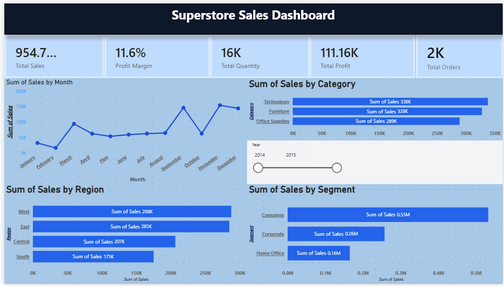

# 📊 Power BI Sales Dashboard

## 📌 Project Overview
This project is an interactive Power BI Sales Dashboard built using the Superstore dataset. It provides valuable insights into sales, profit, orders, and regional performance through interactive visualizations.

## 🛠 Tools Used
- Power BI Desktop
- Power Query
- DAX
- Data Modeling

## 📈 Dashboard Features
- KPI Cards (Sales, Profit, Orders)
- Sales Trend Analysis
- Profit Analysis
- Regional Performance
- Category & Sub-Category Analysis
- Interactive Filters (Slicers)

## 📷 Dashboard Preview

## 📁 Files Included
- `2.pbix` – Power BI Dashboard File
- `superstore-dashboard.png.png` – Dashboard Screenshot

## 🚀 Author
**Aishwary Chavan**# PowerBI-Sales-Dashboard
Interactive Power BI Sales Dashboard with KPIs, Sales Analysis, Profit Trends, and Regional Performance.
